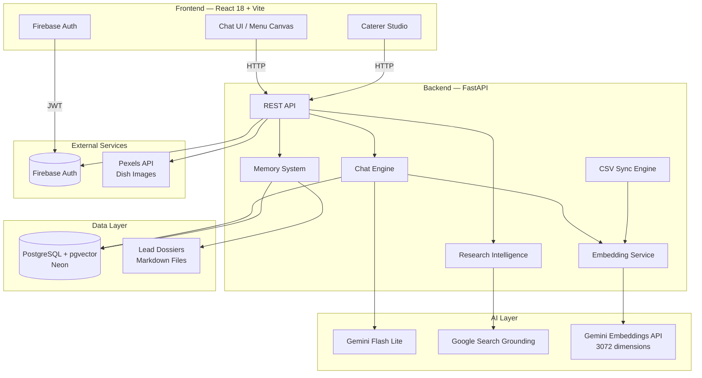
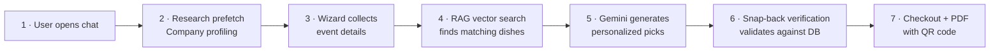

<p align="center">
  
</p>

<h1 align="center">CaterNow</h1>

<p align="center">
  <strong>AI-Powered Catering — From Chat to Checkout in 2 Minutes</strong>
</p>

<p align="center">
  <a href="#-getting-started"></a>
  <a href="#-getting-started"></a>
  <a href="#-how-it-works"></a>
  <a href="#-tech-stack"></a>
  <a href="#-tech-stack"></a>
  <a href="#-deployment"></a>
</p>

<p align="center">
  CaterNow is an AI-powered B2B/B2C catering SaaS that replaces traditional booking forms with a charming conversational agent. It researches your company, recommends dishes using vector similarity search, and handles checkout — all in a single chat flow. Built with RAG, explainable AI, and a full caterer CRM.
</p>

---

## Features

<table>
  <tr>
    <td width="50%" valign="top">
      <h3>🤖 AI Chat Agent</h3>
      <p>A sales-optimized conversational wizard ("Chatty") guides users through event planning, menu selection, and checkout with personality and upselling intelligence.</p>
    </td>
    <td width="50%" valign="top">
      <h3>🔍 RAG + Vector Search</h3>
      <p>177+ dishes vectorized as 3072-dimensional Gemini embeddings. Hybrid search with vector similarity + fuzzy string matching fallback ensures the chat never breaks.</p>
    </td>
  </tr>
  <tr>
    <td width="50%" valign="top">
      <h3>🏢 Research Intelligence</h3>
      <p>Automatically profiles B2B leads — extracts company values, colors, HQ address via domain analysis and Google Search grounding. Pre-fills checkout with AI-resolved addresses.</p>
    </td>
    <td width="50%" valign="top">
      <h3>📊 Explainable AI</h3>
      <p>Every dish recommendation shows a mathematical "AI Match %" score, building trust through transparency. AI-filled fields display visual badges.</p>
    </td>
  </tr>
  <tr>
    <td width="50%" valign="top">
      <h3>🎛️ Caterer Studio</h3>
      <p>Full admin CRM with revenue dashboards (Recharts), order pipeline management, AI memory editor, system health monitors, and one-click database rebuild.</p>
    </td>
    <td width="50%" valign="top">
      <h3>🧠 Long-Term Memory</h3>
      <p>Persistent lead dossiers track mood, preferences, and intelligence findings across sessions. Admins can manually inject context into AI memory.</p>
    </td>
  </tr>
  <tr>
    <td width="50%" valign="top">
      <h3>🔄 Continuous Learning</h3>
      <p>Customer feedback triggers re-vectorization of dishes — the AI's search quality improves with every review. MD5-based change detection for smart CSV syncing.</p>
    </td>
    <td width="50%" valign="top">
      <h3>📄 PDF Export + QR Code</h3>
      <p>Auto-generated order confirmations with full event details, menu breakdown, pricing, and scannable QR codes via jsPDF.</p>
    </td>
  </tr>
</table>

---

## Architecture



---

## Tech Stack

| Layer | Technology | Purpose |
|:------|:-----------|:--------|
| **Frontend** | React 18, Vite 5, React Router 7 | SPA with chat UI, menu canvas, checkout flow |
| **Styling** | CSS Modules, Custom Design System | Apple CI-inspired responsive design |
| **Charts** | Recharts 3 | Admin revenue dashboards and analytics |
| **Auth** | Firebase Auth (Google Login) | Authentication with JWT token verification |
| **Backend** | Python FastAPI, Uvicorn | Async REST API with auto-docs |
| **ORM** | SQLAlchemy 2.0 | Database models with pgvector support |
| **AI Chat** | Gemini 3.1 Flash Lite (v1beta) | Conversational agent with tool use |
| **Embeddings** | `gemini-embedding-001` | 3072-dim vectors for dish similarity search |
| **Search** | Google Search Grounding | Real-time B2B company research |
| **Vector DB** | PostgreSQL + pgvector (Neon) | Hybrid vector similarity + fuzzy matching |
| **Images** | Pexels API | Automatic dish image resolution |
| **PDF** | jsPDF + jspdf-autotable | Order confirmation with QR codes |
| **Markdown** | react-markdown | Rich text rendering in chat |
| **Deploy** | Render.com | Backend web service + frontend static site |

---

<!-- SCREENSHOTS -->
<!--
## Screenshots

Add screenshots here to showcase the product. Recommended shots:

1. **Landing / Hero Page** — First impression of the app
2. **Chat Wizard** — AI agent guiding menu selection
3. **Menu Canvas** — Visual dish cards with AI Match %
4. **Caterer Studio** — Admin dashboard with revenue charts
5. **Checkout + PDF** — Order confirmation with QR code

Example format:
<p align="center">
  
</p>
-->

## Getting Started

### Prerequisites

- Python 3.11.9
- Node.js 20.x
- A [Firebase](https://console.firebase.google.com/) project with Google Auth enabled
- A [Neon](https://neon.tech/) PostgreSQL database with `pgvector` extension
- API keys: [Gemini](https://aistudio.google.com/apikey), [Pexels](https://www.pexels.com/api/) (free)

### Setup

```bash
# Clone the repository
git clone https://github.com/matteo-ise/uni-caternow-booking-service.git
cd uni-caternow-booking-service

# Copy environment template and fill in your keys
cp .env.example .env
```

### Environment Variables

| Variable | Description |
|:---------|:------------|
| `GEMINI_API_KEY` | Google Gemini API key |
| `DATABASE_URL` | Neon PostgreSQL connection string |
| `ADMIN_SECRET` | Password for Caterer Studio access |
| `PEXELS_API_KEY` | Pexels image API key (free tier: 200 req/hr) |
| `VITE_FIREBASE_*` | Firebase project configuration (7 keys) |
| `VITE_API_URL` | Backend URL for frontend API calls |

### Launch Backend

```bash
cd backend
pip install -r requirements.txt
uvicorn main:app --reload
```

The backend auto-syncs dishes from CSV to vector DB on startup (with MD5 change detection).

### Launch Frontend

```bash
cd frontend
npm install
npm run dev
```

Open [http://localhost:5173](http://localhost:5173) to start chatting.

---

<details>
<summary><h2>Project Structure</h2></summary>

```
caternow/
├── backend/
│   ├── main.py              # FastAPI app entry point
│   ├── chat.py              # AI chat engine + research endpoints
│   ├── orders.py            # Order creation and management
│   ├── checkouts.py         # Checkout session handling
│   ├── admin.py             # Caterer Studio API (30+ endpoints)
│   ├── auth.py              # Firebase JWT verification
│   ├── memory.py            # Lead dossier memory system
│   ├── embeddings.py        # Vector search + hybrid RAG
│   ├── research.py          # B2B company intelligence
│   ├── image_resolver.py    # Pexels API dish image resolver
│   ├── db_models.py         # SQLAlchemy models (9 tables)
│   ├── models.py            # Pydantic request/response schemas
│   ├── database.py          # Database connection config
│   ├── sync_logic.py        # CSV → vector DB sync with MD5
│   ├── rebuild_db.py        # Full DB rebuild utility
│   └── data_assets.py       # Static data management
├── frontend/
│   ├── src/
│   │   ├── App.jsx              # Root app with routing
│   │   ├── pages/
│   │   │   ├── CheckoutPage.jsx # Checkout flow
│   │   │   ├── Admin.jsx        # Caterer Studio dashboard
│   │   │   └── Profile.jsx      # User profile + order history
│   │   └── components/
│   │       ├── ChatModal.jsx     # Main chat interface
│   │       ├── ChatPanel.jsx     # Chat message rendering
│   │       ├── MenuCanvas.jsx    # Dish cards with AI Match %
│   │       ├── HeroSection.jsx   # Landing page hero
│   │       ├── Navbar.jsx        # Navigation
│   │       ├── DishImage.jsx     # Smart image component
│   │       ├── generatePDF.js    # PDF + QR code generation
│   │       └── admin/            # Admin sub-components
│   └── public/images/dishes/     # Product photography
├── data/
│   ├── memory/              # Persistent lead dossiers (.md)
│   └── *.csv                # Dish catalog source data
├── render.yaml              # Render.com deploy config
└── .env.example             # Environment variable template
```

</details>

---

<details>
<summary><h2>API Reference</h2></summary>

### Health

| Method | Endpoint | Description |
|:-------|:---------|:------------|
| `GET` | `/api/health` | System health check |

### Chat & Research

| Method | Endpoint | Description |
|:-------|:---------|:------------|
| `POST` | `/chat` | Send message to AI agent |
| `POST` | `/research/prefetch` | Trigger B2B company research |

### Orders & Checkout

| Method | Endpoint | Description |
|:-------|:---------|:------------|
| `POST` | `/orders` | Create a new order |
| `GET` | `/users/me/orders` | Get current user's orders |
| `POST` | `/checkouts` | Create checkout session |
| `GET` | `/checkouts/{id}` | Retrieve checkout details |
| `POST` | `/checkout/story` | Generate order story text |
| `POST` | `/feedback` | Submit dish feedback |

### Users

| Method | Endpoint | Description |
|:-------|:---------|:------------|
| `POST` | `/api/users/sync` | Sync Firebase user to DB |

### Admin (Caterer Studio)

| Method | Endpoint | Description |
|:-------|:---------|:------------|
| `GET` | `/admin/orders` | List all orders |
| `PATCH` | `/admin/orders/{id}` | Update order status |
| `GET` | `/admin/orders-overview` | Revenue overview data |
| `GET` | `/admin/leads` | List all leads |
| `GET` | `/admin/lead-details/{id}` | Lead intelligence report |
| `GET/PUT` | `/admin/memory/{id}` | Read/write lead dossier |
| `GET` | `/admin/users` | List all users |
| `GET` | `/admin/user-profile/{uid}` | User profile details |
| `GET/PUT` | `/admin/user-memory/{uid}` | Read/write user memory |
| `POST` | `/admin/user-profile/{uid}/extract` | AI profile extraction |
| `GET` | `/admin/dishes` | List all dishes |
| `GET` | `/admin/feedbacks` | List all feedback |
| `GET` | `/admin/vector-benchmark` | Vector search stats |
| `GET` | `/admin/image-status` | Dish image coverage |
| `POST` | `/admin/resolve-images` | Trigger Pexels image fetch |
| `POST` | `/admin/upload-csv` | Upload dish catalog CSV |
| `POST` | `/admin/seed-users` | Seed test users |
| `POST` | `/admin/rebuild-db` | Full database rebuild |

> Full interactive API docs available at `/docs` (Swagger UI) when running the backend.

</details>

---

## How It Works

The AI pipeline orchestrates 7 steps from first message to completed order:



1. **Chat opens** — The research engine fires a prefetch to profile the user's company (B2B) via domain analysis
2. **Wizard flow** — Chatty collects event type, guest count, dietary requirements, and budget through natural conversation
3. **Vector search** — 3072-dim embeddings find the most relevant dishes using cosine similarity on pgvector
4. **AI recommendations** — Gemini generates personalized menu suggestions with "AI Match %" scores and storytelling
5. **Snap-back verification** — Every recommendation is validated against the actual database to prevent hallucination
6. **Memory update** — The lead dossier is updated with preferences, mood, and intelligence findings
7. **Checkout** — Address auto-filled from research, PDF generated with menu breakdown, pricing, and QR code

---

## Database Schema

```mermaid
erDiagram
    DBUser {
        int id PK
        string firebase_uid UK
        string email
        string display_name
        int login_count
        timestamp last_login
        int tenant_id
    }

    DBDish {
        int id PK
        string name
        string category
        float price
        string rich_context
        vector embedding
        string image_url
        int tenant_id
    }

    DBOrder {
        int id PK
        int user_id FK
        string status
        json items
        float total
        timestamp created_at
        int tenant_id
    }

    DBCheckout {
        int id PK
        int order_id FK
        string company_name
        string address
        json event_details
        timestamp created_at
    }

    DBFeedback {
        int id PK
        int user_id FK
        int dish_id FK
        int rating
        string comment
        timestamp created_at
        int tenant_id
    }

    DBMemory {
        int id PK
        string lead_id
        text content
        timestamp updated_at
    }

    DBUserMemory {
        int id PK
        string firebase_uid FK
        text content
        timestamp updated_at
    }

    DBSyncState {
        int id PK
        string file_hash
        timestamp last_sync
    }

    DBUsageStats {
        int id PK
        string metric
        float value
        timestamp recorded_at
    }

    DBUser ||--o{ DBOrder : places
    DBUser ||--o{ DBFeedback : writes
    DBOrder ||--o| DBCheckout : has
    DBDish ||--o{ DBFeedback : receives
    DBUser ||--o| DBUserMemory : has
```



---

## Deployment

CaterNow ships with a [`render.yaml`](render.yaml) for one-click deployment on [Render.com](https://render.com):

- **Backend**: Python web service (Frankfurt region, health check at `/api/health`)
- **Frontend**: Static site with SPA rewrite rules

### Deploy Checklist

1. Fork this repo to your GitHub account
2. Connect your repo to Render.com
3. Create an environment group with all variables from [`.env.example`](.env.example)
4. Deploy — Render reads `render.yaml` automatically
5. Verify health at `https://your-backend.onrender.com/api/health`

---

## Contributing

Contributions are welcome! Here's how to get started:

1. **Fork** the repository
2. **Create a branch** (`git checkout -b feature/amazing-feature`)
3. **Commit** your changes (`git commit -m 'feat: add amazing feature'`)
4. **Push** to the branch (`git push origin feature/amazing-feature`)
5. **Open a Pull Request**

Please follow [conventional commits](https://www.conventionalcommits.org/) for commit messages.

---

<p align="center">
  A university project by <a href="https://github.com/matteo-ise">@matteo-ise</a>
</p>
